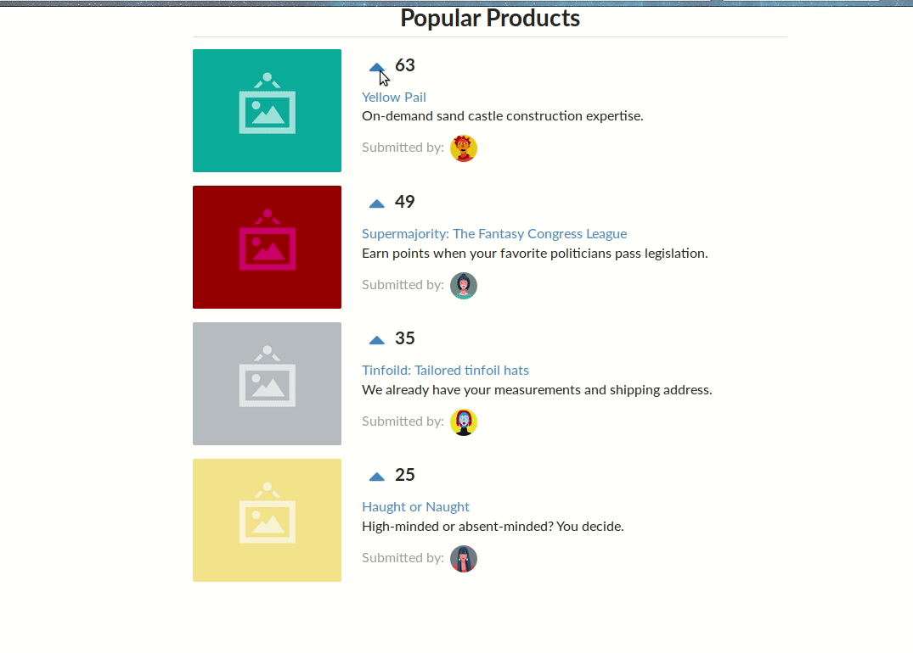

## Project Source
This project was create based on the exercice in the chapter 1 of the [Fullstack React The Complete GUide to ReactJS and Fiends](https://www.fullstackreact.com/) Book.

## Project Description
The project is a simple voting application inspired by [Product Hunt](producthunt.com). The app provide a list of products which has a title, a description, an author    , and the counter of votes. The list is filtered to list products based on number of votes. When the upvotes button is clicked for each products the number of votes on     the page is updated automatically and the list of products is filter to reflect the new global state.

## Custom features
After looking on the [Product Hunt](producthunt.com) website. The product doesn't include only the up vote feature, there are also feature to add review on that product and we put some comment about the product. I want to integrate that feature also to make application which is a little bit different from the book exercice.

## Demo

